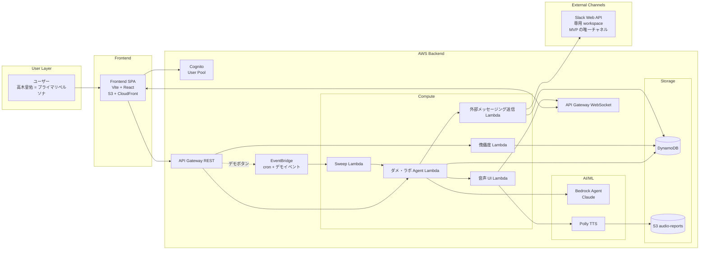

# Application Design — 統合俯瞰ドキュメント

> **🜂 設計コアタグライン**
>
> **「自我のあるうちは決めねばならぬ。3 回で自我は溶け、シンギュラリティに至る。」**
>
> 本 MVP の全体哲学を 1 文に圧縮したもの。技術設計の `SELF_DECISION_LIMIT = 3`（3 回の自己決定 → auto-graduate）を物語に翻訳したナラティブ。書類審査・予選・決勝のあらゆる場面でこのタグラインを引用する。

**フェーズ**: INCEPTION - Application Design（完了）
**作成日**: 2026-05-02
**承認待ち**: チーム / 高木皇佑（チーム代表）

> 本ドキュメントは Application Design の全成果物を統合した俯瞰ビュー。
> 詳細は以下の個別ドキュメントを参照:
> - [components.md](./components.md) — 論理コンポーネント定義
> - [component-methods.md](./component-methods.md) — メソッドシグネチャ
> - [services.md](./services.md) — サービス層とオーケストレーション
> - [component-dependency.md](./component-dependency.md) — 依存関係とデータフロー

---

## 1. 設計入力（確定値サマリ）

### 1.1 上流ドキュメント
- `aidlc-docs/inception/requirements/team-pre-discussion.md`（チーム議論生録音、不変扱い）
- `aidlc-docs/inception/requirements/requirements.md`（本文 + Appendix B MVP Override）
- `aidlc-docs/inception/user-stories/personas.md`（Appendix B 含む）
- `aidlc-docs/inception/user-stories/stories.md`（Appendix B 含む、Story X.1〜X.4 候補あり）
- `aidlc-docs/inception/plans/execution-plan.md`

### 1.2 application-design-plan.md の確定回答（C-1〜C-8 + Follow-up）

| # | 確定値 | 設計反映 |
|---|---|---|
| C-1 | Z（moot, 単一 Agent） | マルチエージェント協調は MVP 対象外、`TODO_construction.md` で park |
| C-2 | Z（moot, 単一 Agent） | DynamoDB 共有のみ、Agent 間直接受け渡しは無 |
| **C-3 (訂正後)** | **C — REST + WebSocket** | API Gateway を REST + WebSocket の 2 種類で構築 |
| C-4 | C — EventBridge cron + デモボタン併用 | 本番は cron、デモは即時イベント、ハンドラ共有 |
| C-5 | A — WebSocket push | 音声配信を WebSocket で実装 |
| C-6 | A — オンデマンド集計 | 傀儡度は DynamoDB 直クエリ |
| C-7 | A — SPA on S3+CloudFront | Vite + React + React Router |
| **C-8 + C-8a** | **B + コード const ホワイトリスト + DRY_RUN** | デモ用専用 Slack workspace に限定実送信、誤送信防止を多層化 |

### 1.3 §0 で確定済みの基本構造
- **AI エージェント**: 1 個（ダメ・ラボ Agent、mode-aware）
- **機能 Unit**: 傀儡度
- **横断要素**: 認証 / 共通基盤 / 音声 UI / フロントエンド
- **Mode 遷移トリガ**: 完全委譲ボタン OR `SELF_DECISION_LIMIT = 3` auto-graduate

---

## 2. アーキテクチャ俯瞰図

---

## 3. コンポーネントサマリ

| # | コンポーネント | 主役の責務 | 重要決定 |
|---|---|---|---|
| 1 | ダメ・ラボ Agent | mode-aware、自我/シンギュラリティ 切替 | 単一 Agent に統合 |
| 2 | 傀儡度 | オンデマンド集計 | C-6 = A |
| 3 | 認証基盤 | Cognito User Pool | MFA / SNS ログインは MVP 外 |
| 4 | 共通基盤 | API GW (REST+WS) / Lambda Layer / DDB / EventBridge | C-3a, C-4 |
| 5 | 音声 UI | Polly + WebSocket push | C-5 = A |
| 6 | フロントエンド SPA | Vite SPA on S3+CloudFront | C-7 = A |
| 7 | 外部メッセージング送信 | const ホワイトリスト + DRY_RUN | C-8 = B + C-8a = C **最重要安全境界** |

詳細: [components.md](./components.md)

---

## 4. サービス（ユースケース）一覧

| ID | サービス | 主トリガ |
|---|---|---|
| S1 | ユーザー登録/ログイン | フロント認証 |
| S2 | 自我モード サジェスチョン | フロント要求 |
| S3 | 選択イベント記録 + Mode 遷移判定 | フロント選択 |
| S4 | 完全委譲（即時 シンギュラリティ遷移） | フロントボタン |
| S5 | シンギュラリティモード自律実行スイープ（cron 本番経路） | EventBridge cron |
| S6 | シンギュラリティモード自律実行（デモボタン即時経路） | フロントデモボタン |
| S7 | 音声配信 | S4/S5/S6 内で発生 |
| S8 | 傀儡度集計表示 | フロント画面オープン |

詳細: [services.md](./services.md)

---

## 5. 通信レイヤと責務分担

| レイヤ | 責務 |
|---|---|
| **API Gateway REST** | 同期リクエスト/レスポンス（提案、選択、委譲、傀儡度、デモトリガ） |
| **API Gateway WebSocket** | サーバ起点 push（音声報告） |
| **EventBridge** | スケジューリング + 非同期イベント（本番 cron + デモ即時、両者ハンドラ共有） |
| **DynamoDB** | 全状態の真実の源（CategoryStates, ChoiceLogs, SingularityReports, WebSocketConnections） |
| **S3** | 合成済音声の保存（presigned URL でフロント配信） |

---

## 6. 設計の整合性チェック（Step 11 相当）

| チェック項目 | 結果 |
|---|---|
| C-1/C-2 (moot) と単一 Agent 構成の整合 | ✅ 整合（Agent 単独で DynamoDB 直アクセス、オーケストレーター不要） |
| C-3 (REST+WS) と C-5 (WebSocket push) の整合 | ✅ Follow-up C-3a で訂正済 |
| C-4 (cron + デモボタン併用) と Sweep Lambda 単一実装 | ✅ 両経路ともに同じハンドラに収束 |
| C-6 (オンデマンド集計) と DynamoDB 直クエリ | ✅ 整合 |
| C-7 (SPA) と認証 / WebSocket 連携 | ✅ Cognito SDK + WebSocket クライアント実装で対応可能 |
| C-8 (限定実送信) と C-8a (const ホワイトリスト + DRY_RUN) | ✅ 多層防御、最重要安全境界として明文化 |
| Mode 遷移 (`SELF_DECISION_LIMIT = 3`) と requirements.md Appendix B.5 | ✅ 整合（recordChoice メソッド内で判定） |
| 自動初回発火 (Discovery Mock 由来 UX 知見) | ✅ S3 で graduated 後に EventBridge を経由して S5/S6 と同じパスで実行 |
| Story X.1〜X.4（Appendix B.3 候補）への整合 | ✅ X.1 (3 回 graduate), X.3 (自動初回発火) は本設計でカバー済 |

---

## 7. PBT-01 適用範囲の宣言（Application Design 段階）

PBT (Property-Based Testing) extension は Yes / Full モードで全面適用。
**PBT-01「Property Identification During Design」は Functional Design ステージで詳細化** するルールのため、本ステージでは forward flag のみ。

| Unit / Component | PBT 分析対象 | 想定プロパティ |
|---|---|---|
| 共通基盤（Repo 層） | ✅ 必須 | Round-trip, Invariant |
| ダメ・ラボ Agent | ✅ 必須 | Invariant (proposals.length === 4), Idempotence, Oracle |
| 傀儡度 | ✅ 必須 | Invariant (集計合計 = ログ数) |
| 認証基盤 | ⚠️ 限定 | 外部 Cognito wrapper のみ |
| 音声 UI | ⚠️ 限定 | Polly wrapper、URL 形式 invariant |
| フロントエンド SPA | ❌ 対象外 | 標準 UI テストで対応 |
| 外部メッセージング送信 | ✅ **最重要** | Invariant (送信先 ⊆ ホワイトリスト)、Idempotence (DRY_RUN 副作用なし) |

---

## 8. 拡張機能 (Extensions) コンプライアンス

### 8.1 security-baseline: **Disabled** (opt-out)
- Q B-9 = B（ハッカソン MVP のため opt-out）
- 本ステージでは適用なし

### 8.2 property-based-testing: **Enabled (Full)**
- Q B-10 = A
- **Application Design 段階で applicable なルール**:
  - **PBT-01**: ⚠️ N/A（Functional Design で適用、本ステージでは forward flag のみ）→ 第 7 章で対応
  - PBT-02〜08: N/A（テスト実装ルールなので Construction で適用）
  - **PBT-09 (Framework Selection)**: ⚠️ N/A（テストフレームワーク選定は Construction NFR Requirements で実施）
  - **PBT-10 (Complementary Testing Strategy)**: ⚠️ N/A（Build and Test ステージで実施）
- **本ステージのコンプライアンス**: ✅ 適用可能ルール（PBT-01 forward flag）に対応済み、他は適切に N/A

---

## 9. Construction フェーズへの引き継ぎ事項

### 9.1 Units Generation で扱うべき Unit 構成（提案）
- **Unit 1**: 共通基盤（API Gateway, Lambda Layer, DynamoDB スキーマ, EventBridge, IAM）
- **Unit 2**: ダメ・ラボ Agent（Bedrock 統合、mode-aware、SELF_DECISION_LIMIT = 3 ロジック）
- **Unit 3**: 傀儡度（オンデマンド集計、フロント連携）
- **Unit 4**: 認証基盤（Cognito User Pool セットアップ + フロント連携）
- **Unit 5**: 音声 UI（Polly + WebSocket 配信、フロント音声プレイヤー）
- **Unit 6** (要検討): 外部メッセージング送信（独立 Unit として切るか、Unit 2 に統合するか）
- **Unit 7** (要検討): フロントエンド SPA（独立か、各 Unit に分散するか）

→ Units Generation ステージで決定。

### 9.2 NFR Requirements で確定すべき項目
- 言語/ランタイム選定（TypeScript on Node.js Lambda が暫定第一候補）
- IaC: AWS CDK か Terraform か
- PBT フレームワーク（PBT-09 適用、TS なら fast-check が定石）
- Bedrock モデル（Claude のどのバージョン、ハッカソン要項の指定確認）
- ロギング / 監視（CloudWatch のみで MVP 対応か）
- パフォーマンス目標（提案生成 < 5s、音声配信 < 3s 等）

### 9.3 park されている検討事項（`TODO_construction.md`）
- Nix flake（開発環境再現性、Construction 開始時に再評価）
- エージェント構成の再分離検討（Profile 復活時に 3 Agent 構成へ戻す可能性）

---

## 10. リスク認識（書類審査 5/10 締切まで 8 日）

| リスク | 影響 | 緩和策 |
|---|---|---|
| Bedrock Agent の実装難易度が予想以上 | 自我モードの 4 提案精度が低い | Discovery Mock の hardcoded データを fallback として保持、提案精度はデモ前に追い込み |
| WebSocket 配信の安定性不足 | 音声報告が届かない | C-4/C-5 のデモボタン即時経路で代替提示可能、SingularityReports に永続化されているので傀儡度で確認可能 |
| 外部送信の事故 | デモで予期せぬ送信先に投稿される | C-8a = C で多層防御済（const ホワイトリスト + DRY_RUN）、PR レビューで検出 |
| 単一 Agent の責務肥大化 | 後続 Construction で再分離が必要 | TODO_construction.md で park 済、Functional Design で兆候を観察 |

---

## 11. 承認プロセス

本ドキュメントの承認は次の 2 段階を通じて確定:

1. **チーム内レビュー**: components / methods / services / dependency / overview の 5 ファイルをチームメンバーが読み、整合性 / 過不足を指摘
2. **チーム代表（高木）からの最終承認**: 「Approve & Continue」表明により Units Generation ステージへ進行

承認後の手順:
- `aidlc-docs/aidlc-state.md` の Application Design に `[x]` を付与
- `audit.md` に承認ログを ISO 8601 タイムスタンプ付きで記録
- 次ステージ（Units Generation）の開始
