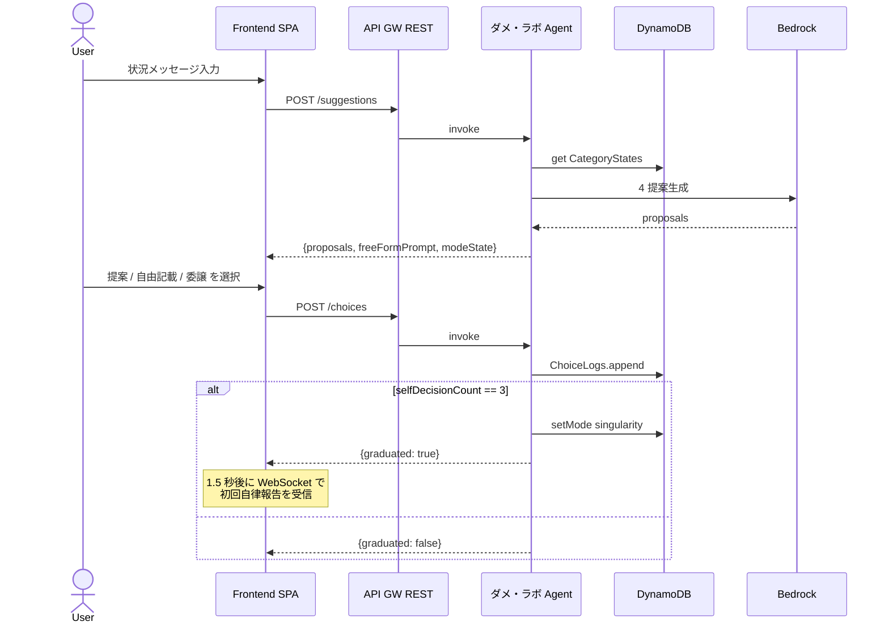
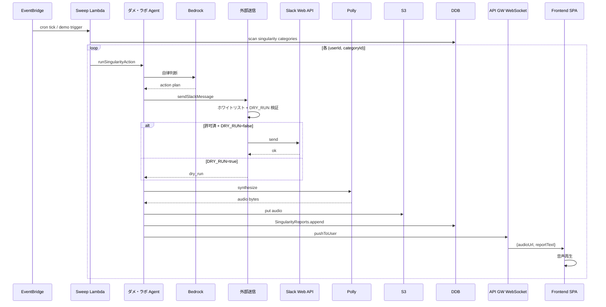
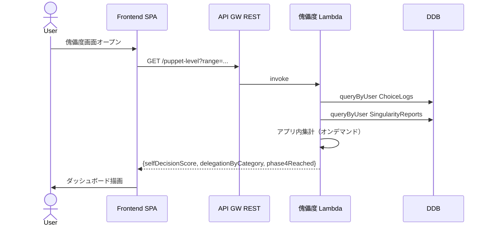

# Component Dependencies — 依存関係マトリクスとデータフロー

**フェーズ**: INCEPTION - Application Design
**作成日**: 2026-05-02

---

## 1. 依存関係マトリクス

行のコンポーネントが、列のコンポーネントに **依存する**（直接呼び出す or データを介して連動）関係を `→` で示す。

| 呼出元 ＼ 呼出先 | フロント | 認証 | API GW | Agent | PuppetLevel | 共通基盤 (DDB/EB) | 音声 UI | 外部送信 |
|---|---|---|---|---|---|---|---|---|
| **フロント SPA** | — | → | → | (経由) | (経由) | — | (受信) | — |
| **認証基盤 (Cognito)** | — | — | (Authorizer) | — | — | — | — | — |
| **API Gateway** | — | (Authorizer) | — | → | → | (WebSocket → DDB) | — | — |
| **ダメ・ラボ Agent** | — | — | — | — | — | → | → | → |
| **傀儡度** | — | — | — | — | — | → | — | — |
| **共通基盤 (EventBridge cron)** | — | — | — | → (sweep) | — | — | — | — |
| **音声 UI** | (push) | — | (WS post) | — | — | → (DDB 接続情報) | — | — |
| **外部メッセージング送信** | — | — | — | — | — | → (ログ DDB) | — | — |

凡例:
- `→`: 直接依存（同期 / 非同期問わず能動的に呼出）
- `(経由)`: API Gateway 経由で間接的に到達
- `(受信)`: 受動的に push を受ける
- `(Authorizer)`: API Gateway での JWT 検証時に Cognito を参照
- `(WS post)`: API Gateway Management API でのコネクションへのメッセージ送信

---

## 2. 通信パターン早見表

| パターン | 採用先 | プロトコル | 同期/非同期 |
|---|---|---|---|
| フロント ↔ API Gateway REST | S1, S2, S3, S4, S6 trigger, S8 | HTTPS REST | 同期 |
| フロント ↔ API Gateway WebSocket | S7 音声配信 | WSS | 非同期 push |
| Lambda ↔ DynamoDB | 全 Repo | AWS SDK | 同期 |
| Lambda ↔ Bedrock | ダメ・ラボ Agent | AWS SDK | 同期 |
| Lambda ↔ Polly | 音声 UI | AWS SDK | 同期 |
| Lambda ↔ S3 | 音声 UI（合成済音声保存） | AWS SDK | 同期 |
| EventBridge → Lambda | S5 cron, S6 デモイベント | EventBridge | 非同期 (best-effort) |
| Lambda ↔ Slack Web API | 外部メッセージング送信（**MVP は Slack のみ**） | HTTPS API | 同期 |

---

## 3. データフロー図

### 3.1 自我モード フロー（S2 + S3）

### 3.2 シンギュラリティモード フロー（S5 cron / S6 デモ）

### 3.3 傀儡度 フロー（S8）

---

## 4. データ永続化先マッピング

| データ種別 | 主たる保存先 | 主たる読み手 |
|---|---|---|
| ユーザープロファイル | Cognito User Pool + DynamoDB `Users` | 全 Lambda |
| カテゴリ別 mode 状態 | DynamoDB `CategoryStates` | ダメ・ラボ Agent, 傀儡度 |
| 選択ログ | DynamoDB `ChoiceLogs` | ダメ・ラボ Agent (書込), 傀儡度 (読) |
| 自律実行報告 | DynamoDB `SingularityReports` | ダメ・ラボ Agent (書込), 傀儡度 (読), 音声 UI (URL 参照) |
| 合成済音声 | S3 (`audio-reports/`) | フロントが presigned URL で取得 |
| WebSocket 接続情報 | DynamoDB `WebSocketConnections` | 音声 UI |
| 外部送信ログ | DynamoDB `ExternalMessageLogs`（または `ChoiceLogs` に集約） | 監査用、傀儡度で詳細表示可（Construction で詳細化） |

---

## 5. 結合度（Coupling）の評価

| ペア | 結合度 | 備考 |
|---|---|---|
| ダメ・ラボ Agent ↔ DynamoDB | **高**（Repo 経由で抽象化はする） | 単一 Agent 設計の必然 |
| ダメ・ラボ Agent ↔ Bedrock | **中** | AWS SDK 経由、モデル切替は env で対応 |
| ダメ・ラボ Agent ↔ 外部送信 | **中**（明示的なインタフェース） | 安全境界が外部送信側に集中 |
| 音声 UI ↔ WebSocket 接続情報 | **中** | 接続情報を DynamoDB に置くことで Agent と疎結合 |
| 傀儡度 ↔ DynamoDB | **高** | オンデマンド集計の必然 |
| フロント ↔ API Gateway | **低** | REST/WebSocket の標準的契約 |

**MVP では許容**: 単一 Agent + オンデマンド集計の単純設計を優先。Construction フェーズで結合度が問題になったら、Repo 層の抽象化強化や CQRS 分離を検討（park）。

---

## 6. 障害伝播の考え方（高レベル、詳細は NFR Design で）

| 故障点 | 影響範囲 | MVP の対応 |
|---|---|---|
| Bedrock 応答遅延/失敗 | 自我モード提案不能 | 1 回リトライ後、相棒トーンの「ちょっと考え中」プレースホルダ |
| DynamoDB 障害 | 全機能停止 | AWS マネージド SLA 依存、MVP では特別な fallback 実装なし |
| WebSocket 切断 | 音声報告が届かない | SingularityReports に永続化済なので次回傀儡度画面で確認可能 |
| Polly 失敗 | 音声生成不能 | テキスト報告だけ届ける（音声は再試行 1 回） |
| 外部送信 (Slack) 失敗 | 該当カテゴリの シンギュラリティ実行が部分失敗 | DRY_RUN にフェイルオープン、エラーログ + フロントには「やろうとしたよ、でも届かなかった」 |
| ホワイトリスト違反 | 送信ブロック（**意図された fail-fast**） | 例外を throw、ログに残し管理者通知（MVP では CloudWatch ログ確認）|

---

## 7. PBT 適用観点での依存性（PBT-01 forward flag）

依存関係から見ると、以下の境界に PBT を **必ず** 設けるべき:
- 共通基盤の Repo 層 ↔ DynamoDB（Round-trip: 書込 → 読出 = 入力）
- ダメ・ラボ Agent ↔ Bedrock（Oracle: hardcoded 期待挙動との照合、テスト時 mock）
- 外部送信のホワイトリスト検証（Invariant: 送信先 ⊆ ホワイトリスト が常時成立）

詳細は Functional Design (per-unit) で展開。
