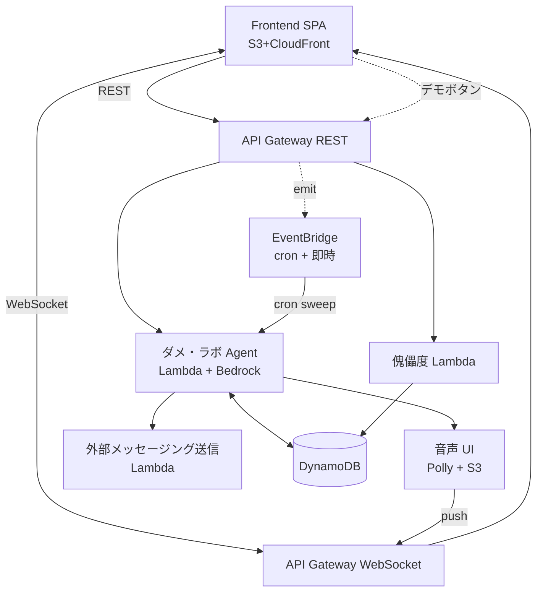

# Services — サービス層とオーケストレーション

**フェーズ**: INCEPTION - Application Design
**作成日**: 2026-05-02

> **Note**: ここで「サービス」は **コンポーネントを跨いで責務をオーケストレーションするユースケース単位** を指す（ドメイン駆動設計の Application Service に近い）。
> 各サービスは 1〜複数のコンポーネントを呼び出し、ユーザーの 1 シナリオを完結させる。

---

## サービス一覧

| # | サービス名 | トリガ | 関係コンポーネント | API 種別 |
|---|---|---|---|---|
| S1 | **オンボーディング（名前入力でセッション開始）** | フロント初回起動 | フロントエンド SPA のみ（ローカルストレージ保持） | フロント完結（バックエンド呼出なし） |
| S2 | **自我モード サジェスチョン** | フロントからの提案要求 | ダメ・ラボ Agent + 共通基盤 | REST 同期 |
| S3 | **選択イベント記録 + Mode 遷移判定** | フロントからの選択 / 委譲アクション | ダメ・ラボ Agent + 共通基盤 | REST 同期 |
| S4 | **完全委譲（即時 シンギュラリティ遷移）** | フロントの完全委譲ボタン | ダメ・ラボ Agent + 共通基盤 + 音声 UI | REST 同期 + WebSocket push |
| S5 | **シンギュラリティモード自律実行スイープ（cron）** | EventBridge cron | ダメ・ラボ Agent + 外部送信 + 音声 UI + 共通基盤 | EventBridge 非同期 |
| S6 | **シンギュラリティモード自律実行（デモボタン即時）** | フロントのデモボタン | 上記 S5 と同じ実装、トリガが異なるだけ | REST → EventBridge → 非同期 |
| S7 | **音声配信** | 上記 S4/S5/S6 内で発生 | 音声 UI + 共通基盤 (WebSocket) | WebSocket push |
| S8 | **傀儡度集計表示** | フロントの傀儡度画面オープン | 傀儡度 + 共通基盤 | REST 同期（オンデマンド） |

---

## S1. オンボーディング（名前入力でセッション開始）

```
[Frontend SPA] 起動
       ↓
ローカルストレージに userName / userId(hardcoded "demo-user-001") があるか確認
       ↓ なし
[OnboardingScreen] で名前を聞く（"あなたを何と呼べばいい？"）
       ↓ 入力
ローカルストレージに保存 → カテゴリ選択画面へ
```

**責務**:
- フロントエンドのみで完結、バックエンド呼出なし
- 認証基盤は MVP 撤廃（2026-05-02、user 指示）。マルチユーザー対応時に Cognito で復活予定（`TODO_construction.md` で park）
- バックエンドへの API 呼出は user_id を request body / header に含めて送る方式

---

## S2. 自我モード サジェスチョン

```
[Frontend] --POST /suggestions--> [API GW REST] --> [ダメ・ラボ Agent Lambda]
                                                       ↓
                                               [Bedrock Agent 呼出]
                                                       ↓
                                  4 提案 + 自由記載枠を返却
                                                       ↓
                                           [DynamoDB: ChoiceLogs]
                                                  (まだ書込まない、recordChoice で書込)
[Frontend] <-- proposals + freeFormPrompt + modeState
```

**責務**:
- ダメ・ラボ Agent が Bedrock を呼び context 推論 + 4 提案生成
- mode が singularity なら proposals は空、modeState のみ返却（フロントが画面切替）

**エラーケース（Construction で詳細化）**:
- Bedrock 失敗 → MVP では再試行 1 回 + フロントへ「ちょっと考え中…」プレースホルダ
- レスポンス時間 > 5s → タイムアウト警告を相棒トーンで返す

---

## S3. 選択イベント記録 + Mode 遷移判定

```
[Frontend] --POST /choices {type: proposal|self|delegate}--> [API GW REST]
                                                                 ↓
                                                    [ダメ・ラボ Agent.recordChoice]
                                                                 ↓
                                            [DynamoDB: ChoiceLogs.append]
                                                                 ↓
                                  type が "self"/"freeText" なら selfDecisionCount++
                                  3 到達なら mode を singularity に変更 + graduated: true
                                                                 ↓
                                  graduated なら EventBridge に「ようこそ シンギュラリティ」イベント発火
                                                                 ↓
                                  → S5 と同じパスで初回自律実行を発火（1.5 秒後の沈黙回避）
```

**責務**:
- 選択ログを永続化
- SELF_DECISION_LIMIT = 3 ロジック評価
- 自動 graduate 時は **音声報告の自動初回発火** を予約（Discovery Mock の知見継承、`requirements.md` Appendix B.5 / `stories.md` Story X.1, X.3）

---

## S4. 完全委譲（即時 シンギュラリティ遷移）

```
[Frontend] --POST /delegate-completely--> [API GW REST]
                                              ↓
                                     [ダメ・ラボ Agent]
                                              ↓
                          [DynamoDB: CategoryStates.setMode = singularity]
                                              ↓
                              EventBridge 発火 → S5 と同じパスで初回実行
[Frontend] <--{modeState: singularity}--
            (フロントは画面を SingularityScreen に切替、WebSocket 接続準備)
```

---

## S5. シンギュラリティモード自律実行スイープ（cron 本番経路）

```
[EventBridge cron (例: 30 min 間隔)]
             ↓
[Sweep Lambda]
   1. CategoryStatesRepo.scan で modeState = singularity の (userId, categoryId) を列挙
   2. 各エントリに対し ダメ・ラボ Agent.runSingularityAction を呼出
             ↓
   3. ダメ・ラボ Agent (Bedrock):
       - 観察データ + context 推論
       - 必要なら 外部メッセージング送信 を呼出
             ↓
   4. 音声 UI.synthesizeReport で Polly 合成 → S3 保存
             ↓
   5. SingularityReportsRepo.append で報告永続化
             ↓
   6. 音声 UI.pushToUser で WebSocket 配信 (S7)
```

**責務分担**:
- Sweep Lambda: 対象列挙とループ制御（オーケストレーター役）
- ダメ・ラボ Agent: 自律判断 + 外部送信指示
- 音声 UI: 合成 + 配信
- 共通基盤: 永続化

**MVP の頻度**:
- 本番想定: 30 分おき（or 1 時間）
- デモ時: 後述 S6 でボタン即時発火

---

## S6. シンギュラリティモード自律実行（デモボタン即時経路）

```
[Frontend デモボタン] --POST /demo/trigger-singularity {userId, categoryId}--> [API GW REST]
                                                                                  ↓
                                                       [Lambda: emitDemoTrigger]
                                                                                  ↓
                                  EventBridge にカスタムイベント emit
                                                                                  ↓
                                  S5 の Sweep Lambda と同じハンドラが受信して即時実行
                                  (対象は emit に含まれた 1 エントリのみ)
```

**責務**:
- 本番経路（cron）と実装を共有しデモ時の挙動の信頼性を担保
- デモ時の権限制御: `DEMO_MODE_ENABLED=true` env でのみエンドポイント有効化（本番では 404）

---

## S7. 音声配信

```
[音声 UI.pushToUser]
        ↓
[WebSocketConnectionsRepo.findByUser(userId)]
        ↓
ヒットした全 connectionId に対し API GW Management API で postToConnection
        ↓
{ type: "singularity_report", audioUrl, reportText, categoryId }
        ↓
[Frontend WebSocket onmessage] → 音声プレイヤーで再生
```

**責務**:
- 1 ユーザー複数接続（PC + スマホ等）を考慮、全接続に push
- 接続切れ（GoneException）は WebSocketConnectionsRepo.unregister で掃除

**MVP 限界**:
- フロントが WebSocket 未接続時の通知は **保留**（履歴として SingularityReports に残るので次回ログイン時の傀儡度で確認可能）
- メッセージキュー / リトライは MVP では実装しない（Construction NFR で再評価）

---

## S8. 傀儡度集計表示

```
[Frontend PuppetLevelScreen mount] --GET /puppet-level?range=...--> [API GW REST]
                                                              ↓
                                                  [傀儡度 Lambda]
                                                              ↓
                              ChoiceLogsRepo.queryByUser + SingularityReportsRepo.queryByUser
                                                              ↓
                                               アプリ内で集計（オンデマンド、C-6 = A）
                                                              ↓
[Frontend] <-- selfDecisionScore + delegationByCategory + phase4Reached
```

**責務**:
- DynamoDB を直クエリしアプリ内集計
- 集計テーブル / マテビューは MVP では作らない

---

## サービス境界の俯瞰



> **Mermaid syntax 注**: 上記は GitHub / GitLab 互換の Mermaid flowchart 構文。`fenced code block + mermaid` で描画される。

---

## オーケストレーションの方針まとめ

| パターン | 採用箇所 | 理由 |
|---|---|---|
| **同期 REST** | S1, S2, S3, S4 (initial), S6 (trigger), S8 | 即応性が必要、フロントが応答待つ |
| **WebSocket push** | S7 (音声配信) | サーバ起点の通知、C-3a/C-5 = A |
| **EventBridge 非同期** | S5 cron, S6 即時イベント | スケジューリングと「ファイヤ＆フォーゲット」、本番/デモで実装共有 |
| **DynamoDB 共有ストア** | 全サービス | C-2 の moot 化 + 単一 Agent が直アクセスで十分 |

オーケストレーター Lambda（C-1 の B 案）は **採用しない**: 単一 Agent なのでオーケストレーション層を別途設けず、Lambda ハンドラ自身がフロー制御を担う。
