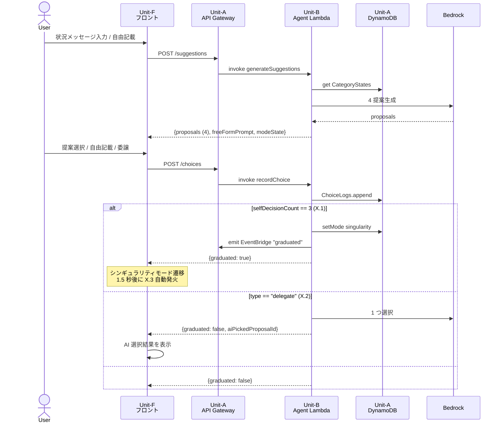
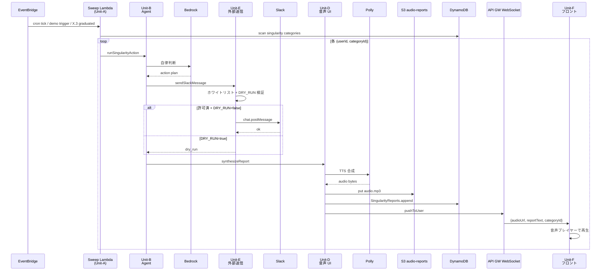
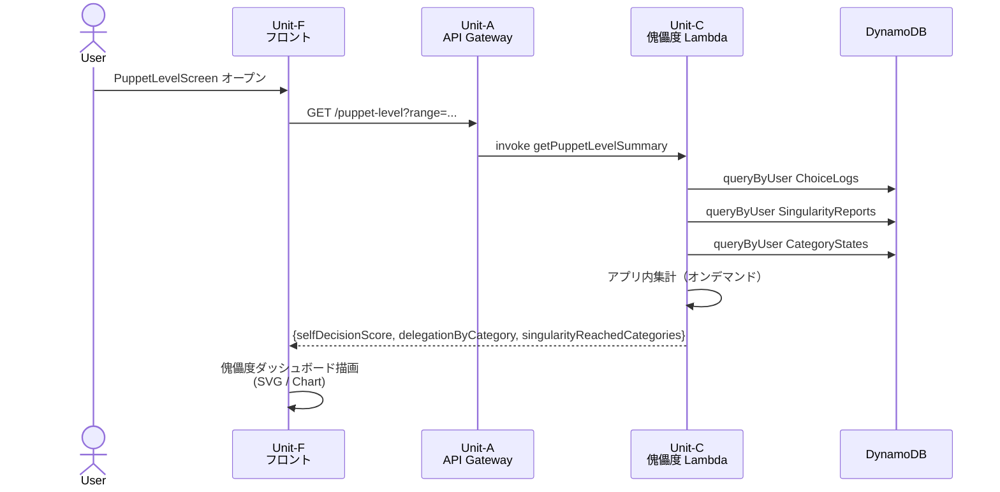
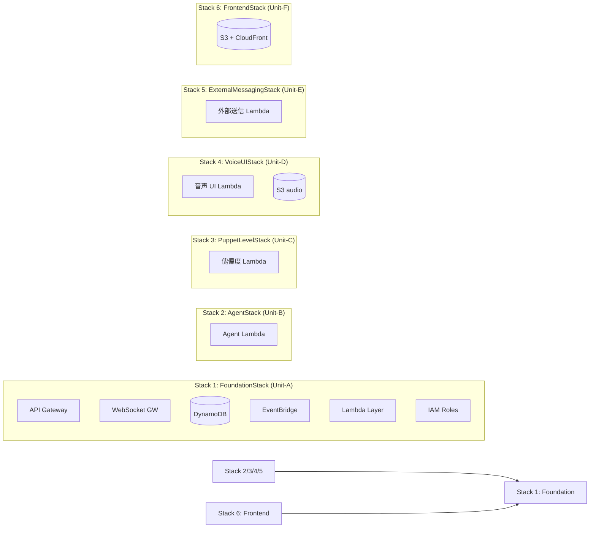

# Unit 間依存マトリクス & データフロー

> **🜂 設計コアタグライン**
>
> **「自我のあるうちは決めねばならぬ。3 回で自我は溶け、シンギュラリティに至る。」**

**フェーズ**: INCEPTION - Units Generation（PART 2: Generation）
**作成日**: 2026-05-02
**前提**: `unit-of-work.md` で 6 Unit 定義済

---

## 1. Unit 間依存マトリクス

行の Unit が、列の Unit に **依存する**（直接呼び出す or データを介して連動）関係を `→` で示す。

| 呼出元 ＼ 呼出先 | A 共通基盤 | B Agent | C 傀儡度 BE | D 音声 UI BE | E 外部送信 | F フロント |
|---|---|---|---|---|---|---|
| **A 共通基盤** | — | — | — | — | — | — |
| **B Agent** | → (DDB / Bedrock) | — | — | → (Polly 報告) | → (Slack 送信) | — |
| **C 傀儡度 BE** | → (DDB クエリ) | — | — | — | — | — |
| **D 音声 UI BE** | → (DDB / S3 / WS) | — | — | — | — | (push) |
| **E 外部送信** | → (DDB ログ) | — | — | — | — | — |
| **F フロント** | → (REST / WS) | (経由 A) | (経由 A) | (受信) | — | — |

### 凡例
- `→`: 直接依存（同期 / 非同期問わず能動的に呼出）
- `(経由)`: 共通基盤 (Unit-A) 経由で間接到達
- `(受信)`: 受動的に push を受ける
- `(push)`: API Gateway WebSocket Management API で送信
- `—`: 依存なし

### 重要な観察
- **Unit-A は他 Unit に依存しない（最下層）** — 最初に deploy すべき Unit
- **Unit-B は Unit-D / Unit-E を呼ぶ** — シンギュラリティモード時の音声報告 + Slack 送信
- **Unit-C / D / E は互いに独立** — 並行実装可能
- **Unit-F は Unit-A 経由のみ** — フロントから直接 backend Unit を呼ばない（ApiClient → API Gateway → Lambda）
- **依存グラフは DAG（循環なし）** — 検証済

---

## 2. 通信パターン早見表

| パターン | 採用先 | プロトコル | 同期/非同期 |
|---|---|---|---|
| F → A → B / C / D / E | 全 REST API（提案 / 選択 / 委譲 / 傀儡度 / デモトリガ） | HTTPS REST | 同期 |
| F ↔ A (WebSocket) | 音声報告 push | WSS | 非同期 push |
| Unit (Lambda) → A (DynamoDB) | 全永続化 | AWS SDK | 同期 |
| B → Bedrock | Claude 推論呼出 | AWS SDK | 同期 |
| D → Polly | TTS 合成 | AWS SDK | 同期 |
| D → S3 | 音声ファイル保存 | AWS SDK | 同期 |
| D → A (WebSocket Management API) | フロントへ push | AWS SDK | 同期 |
| EventBridge → A → B | cron sweep + デモ即時 | EventBridge | 非同期 (best-effort) |
| B → E (Slack) | 外部送信 | Lambda invoke | 同期（or async） |
| E → Slack Web API | 送信実行 | HTTPS API | 同期 |

---

## 3. データフロー図

### 3.1 自我モード フロー（Story 1.3 / 4.1 / X.2 / X.4）

### 3.2 シンギュラリティモード フロー（Story 2.4 / 3.4 / 4.3 / X.3）

### 3.3 傀儡度ダッシュボード フロー（Story 5.1〜5.5）

---

## 4. データ永続化先マッピング

| データ種別 | 主たる保存先 | 主たる読み手 | 関連 Story |
|---|---|---|---|
| ユーザー識別子（hardcoded demo-user-001） | フロントローカルストレージ | Unit-F | 1.1 |
| カテゴリ別 mode 状態 + selfDecisionCount | DynamoDB `CategoryStates` (Unit-A) | Unit-B / Unit-C | X.1 / 5.1 |
| 選択ログ | DynamoDB `ChoiceLogs` (Unit-A) | Unit-B (write) / Unit-C (read) | 1.3 / 4.1 / X.2 / X.4 |
| シンギュラリティ実行報告 | DynamoDB `SingularityReports` (Unit-A) | Unit-B (write) / Unit-C / Unit-D (read) | 2.4 / 3.4 / 4.3 / X.3 |
| 合成済音声 | S3 `audio-reports/` (Unit-A) | Unit-F (presigned URL) | 2.4 / 3.4 / X.3 |
| WebSocket 接続情報 | DynamoDB `WebSocketConnections` (Unit-A) | Unit-D | 2.4 / 3.4 / X.3 |
| 外部送信ログ | DynamoDB `ExternalMessageLogs` (Unit-A) | 監査用、Unit-C で詳細表示可 | 2.4 / 3.4 |

**注**: 全永続化が Unit-A に集約される（U-5 = A: Unit-A 完全集約方針）。

---

## 5. 結合度（Coupling）の評価

| ペア | 結合度 | 備考 |
|---|---|---|
| Unit-B ↔ Unit-A (DynamoDB) | **高**（Repo 経由で抽象化） | 単一 Agent 設計の必然 |
| Unit-B ↔ Bedrock | **中** | AWS SDK 経由、モデル切替は env で対応 |
| Unit-B ↔ Unit-E | **中**（明示的なインタフェース sendSlackMessage） | 安全境界が Unit-E 側に集中 |
| Unit-B ↔ Unit-D | **中**（synthesizeReport 呼出） | Polly 呼出を Unit-D に閉じ込め |
| Unit-D ↔ Unit-A (WebSocket Management) | **中** | 接続情報を DynamoDB に置くことで Agent と疎結合 |
| Unit-C ↔ Unit-A (DynamoDB) | **高** | オンデマンド集計の必然 |
| Unit-F ↔ Unit-A (REST/WS) | **低** | API Gateway を介した標準的契約 |
| Unit-F ↔ 各 BE Unit | **無**（直接依存なし） | API Gateway 経由のみ |

**MVP では許容**: 単一 Agent + オンデマンド集計の単純設計を優先。Construction フェーズで結合度が問題になったら、Repo 層の抽象化強化や CQRS 分離を検討（park）。

---

## 6. 障害伝播の考え方（高レベル、詳細は NFR Design で）

| 故障点 | 影響 Unit | 影響範囲 | MVP の対応 |
|---|---|---|---|
| Bedrock 応答遅延/失敗 | Unit-B | 自我モード提案不能 | 1 回リトライ後、相棒トーンの「ちょっと考え中」プレースホルダ |
| DynamoDB 障害 | Unit-A | 全機能停止 | AWS マネージド SLA 依存、MVP では特別な fallback 実装なし |
| WebSocket 切断 | Unit-A / Unit-D | 音声報告が届かない | SingularityReports に永続化済なので次回ログイン時の傀儡度で確認可能 |
| Polly 失敗 | Unit-D | 音声生成不能 | テキスト報告だけ届ける（音声は再試行 1 回） |
| Slack 送信失敗 | Unit-E | 該当カテゴリの シンギュラリティ実行が部分失敗 | DRY_RUN にフェイルオープン、エラーログ + フロントには「やろうとしたよ、でも届かなかった」 |
| ホワイトリスト違反 | Unit-E | 送信ブロック（**意図された fail-fast**） | 例外を throw、ログに残し管理者通知（MVP では CloudWatch ログ確認） |
| EventBridge 遅延 | Unit-A | シンギュラリティ実行が遅延 | best-effort 配送、デモ時はボタン即時経路でリカバリ |

---

## 7. PBT 適用観点での Unit 境界（PBT-01 forward flag）

依存関係から見ると、以下の Unit 境界に PBT を **必ず** 設けるべき:

| Unit 境界 | プロパティカテゴリ | 想定検証内容 |
|---|---|---|
| Unit-B ↔ DynamoDB（Repo 層、Unit-A） | Round-trip | 書込 → 読出 = 入力 |
| Unit-B ↔ Bedrock | Oracle | hardcoded 期待挙動との照合（テスト時 mock） |
| **Unit-E ホワイトリスト検証**（最重要） | Invariant | 送信先 ⊆ ALLOWED_SLACK_CHANNELS が常時成立、DRY_RUN 時は副作用なし |
| Unit-C 集計ロジック | Invariant | 集計合計 = ChoiceLogs 総数、Idempotence（同じログから 2 回計算 = 同じ結果） |
| Unit-B SELF_DECISION_LIMIT = 3 ロジック | Invariant + Idempotence | 3 到達で必ず singularity 遷移、再実行で結果不変 |

詳細は各 Unit の Functional Design で展開（PBT-01 適用）。

---

## 8. デプロイ依存（U-3 = A: Mono-repo + multi-Lambda + CDK Stack 分割）

### Deploy 順序
1. **FoundationStack** を最初に deploy（土台）
2. **AgentStack / PuppetLevelStack / VoiceUIStack / ExternalMessagingStack** は並行 deploy 可能（互いに独立）
3. **FrontendStack** は API endpoint URL が確定してから deploy（環境変数で受け取る）

---

## 9. 検証チェックリスト

| 検証項目 | 結果 |
|---|---|
| 依存グラフが DAG（循環なし） | ✅ |
| Unit-A が最下層（依存先なし） | ✅ |
| Unit-F が直接 BE Unit を呼ばない（API GW 経由） | ✅ |
| 全 Unit が Unit-A の何らかのリソースを使用（過剰集約のリスクは Construction で再評価） | ✅ MVP では許容 |
| データ永続化先が Unit-A に統一 | ✅ U-5 = A 方針 |
| PBT 適用境界の特定 | ✅ 5 境界、最重要は Unit-E ホワイトリスト |
| 障害伝播経路の documenting | ✅ 7 故障点 |
| デプロイ Stack 分割 | ✅ 6 Stack（FoundationStack 起点） |

---

## 10. Construction フェーズへの引き継ぎ

各 Unit の **NFR Design** ステージで詳細化:
- 障害時の retry / timeout 戦略
- API レスポンスのキャッシュ
- WebSocket 切断時の reconnect 戦略
- Bedrock cost 最適化（プロンプトキャッシュ、モデル選定）

各 Unit の **Infrastructure Design** ステージで詳細化:
- CDK Stack 詳細実装
- IAM Role 最小権限
- VPC / Endpoint の必要性検討
- ログ集約（CloudWatch Logs）
