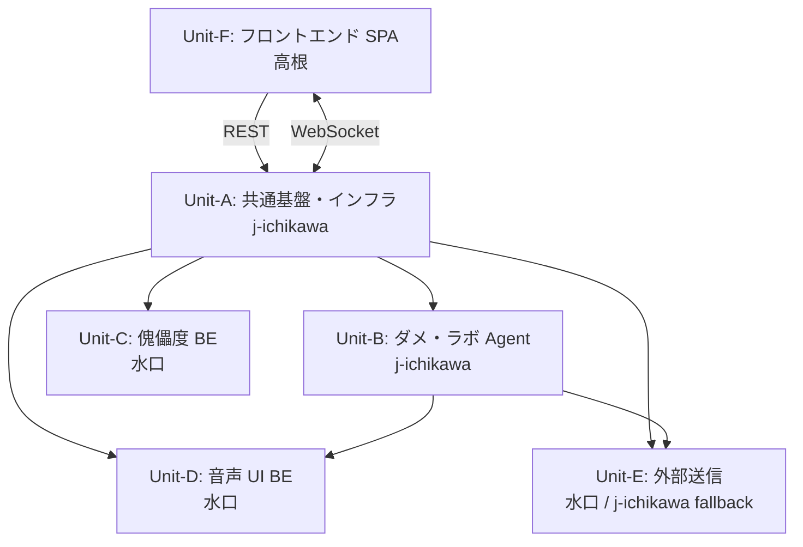

# Units of Work — Unit 定義書

> **🜂 設計コアタグライン**
>
> **「自我のあるうちは決めねばならぬ。3 回で自我は溶け、シンギュラリティに至る。」**

**フェーズ**: INCEPTION - Units Generation（PART 2: Generation）
**作成日**: 2026-05-02
**前提**: `unit-of-work-plan.md` U-1〜U-7 確定回答に基づく

> 本ドキュメントは MVP の **6 Unit 構成**を定義する。各 Unit の責務、所有権、依存先、コード組織を documenting する書類審査向け正規版。
> 関連:
> - [unit-of-work-dependency.md](./unit-of-work-dependency.md) — Unit 間依存マトリクス
> - [unit-of-work-story-map.md](./unit-of-work-story-map.md) — Story → Unit マッピング（書類審査用正規版）
> - [unit-of-work.drawio](./unit-of-work.drawio) — 視覚的 Unit 構成図

---

## 1. Unit 構成（6 Unit）

| Unit | 名称 | カテゴリ | 主担当 | Fallback |
|---|---|---|---|---|
| **A** | 共通基盤・インフラ | Infrastructure | j-ichikawa | — |
| **B** | ダメ・ラボ Agent | AI 中核 | j-ichikawa | — |
| **C** | 傀儡度 BE | Backend Lambda | 水口 | — |
| **D** | 音声 UI BE | Backend Lambda | 水口 | — |
| **E** | 外部メッセージング送信 | Backend Lambda | 水口 | j-ichikawa |
| **F** | フロントエンド SPA | Frontend | 高根 | — |

### 1.1 担当配分の論理
- **高根さん**（FE 専任、インフラ苦手）→ Unit-F 一括所有
- **水口さん**（BE 専任 = API/Lambda 開発、インフラ苦手）→ Unit-C/D/E（純 Lambda 実装）
- **j-ichikawa**（フルスタック + AI/ML + インフラ）→ Unit-A（インフラ・IaC メイン）+ Unit-B（Bedrock）+ Unit-E fallback（Slack API ナレッジあり）

担当配分の前提: チーム 3 名構成（`memory/project_team_structure.md` 参照）。決勝プレゼンでマルチユーザー訴求のプランがないため、認証基盤 Unit は **撤廃済**（2026-05-02、`requirements.md` Appendix B.9）。

---

## 2. 各 Unit の詳細定義

### Unit-A: 共通基盤・インフラ

**Purpose**: 全 Unit の土台となる AWS インフラレイヤと Lambda 共通コードを提供。

**主担当**: j-ichikawa（インフラ・IaC メイン担当）

**Responsibilities**:
- **API Gateway REST**: フロントからの同期 API ルーティング（認証なし、user_id は body / header で受け取る）
- **API Gateway WebSocket**: 音声通知 push 用の永続接続管理
- **Lambda Common Layer**: ロギング / エラーハンドリング / user_id 解決 / DynamoDB Repo 抽象化
- **DynamoDB スキーマ定義**:
  - `Users`（PK: userId、MVP は単一 demo-user-001 hardcoded）
  - `CategoryStates`（PK: userId, SK: categoryId、modeState = "ego" | "singularity"、selfDecisionCount: number）
  - `ChoiceLogs`（PK: userId, SK: timestamp#categoryId）
  - `SingularityReports`（PK: userId, SK: timestamp#categoryId）
  - `WebSocketConnections`（PK: connectionId、userId 解決用）
- **EventBridge**: シンギュラリティモード自律実行 cron（30 分間隔）+ デモボタン即時イベント
- **IAM Roles**: 各 Lambda 用 Role、最小権限原則
- **CDK Stack**: 全 AWS リソースを IaC で管理、Stack 分割は Unit 単位

**Interfaces**:
- 全 Unit が依存する横断レイヤ
- Lambda Common Layer は他 Unit のコードから import される

**境界外（含めない）**:
- 認証基盤（Cognito）— MVP 撤廃済
- 個別 Lambda の業務ロジック実装（各 Unit に閉じる）

**所有 Story**: なし（インフラ Unit のため Story 直接所有なし、全 Story の前提条件を提供）

---

### Unit-B: ダメ・ラボ Agent（**Bedrock AgentCore 上に実装**）

**Purpose**: 単一の AI エージェントとして、自我モード / シンギュラリティモードを切り替えて動作する MVP の AI 中核。**Amazon Bedrock AgentCore Runtime 上に Agent を host し、AgentCore Gateway 経由で tools (Lambda) を呼び出す構成**。

**主担当**: j-ichikawa（AI/ML、Bedrock AgentCore 統合）

> **設計コアタグラインの実装本体**:
> > 「自我のあるうちは決めねばならぬ。3 回で自我は溶け、シンギュラリティに至る。」
>
> AgentCore Runtime 上の Agent システムプロンプトに本タグラインを埋め込む（Functional Design で正式化）。

**Bedrock AgentCore 構成要素の採用**:
| AgentCore 要素 | 採用 | 用途 |
|---|---|---|
| **AgentCore Runtime** | ✅ | Agent 本体のホスティング（コンテナ実行）。任意フレームワーク (Strands Agents / LangGraph 等) で書ける |
| **AgentCore Gateway** | ✅ | tools (Lambda) を Agent から呼び出す統合レイヤ |
| **AgentCore Memory** | ✅ | 短期記憶（カテゴリ単位の context）+ 長期記憶（ユーザー嗜好の蓄積、MVP では限定的に） |
| **AgentCore Identity** | ❌ | 認証撤廃済のため不要、demo-user-001 固定 |
| **AgentCore Observability** | ✅ | CloudWatch Metrics / Logs 経由で agent 動作を可視化（NFR-5 監視要件） |
| **AgentCore Code Interpreter** | ❌ | MVP 不要 |
| **AgentCore Browser** | ❌ | MVP 不要 |

**Responsibilities**:
- **AgentCore Runtime**: Agent 本体（システムプロンプト + mode 切替ロジック + Bedrock model 推論）
  - **自我モード**: 4 提案 + 自由記載枠生成
  - **シンギュラリティモード**: 自律判断 → tool 呼出 → 音声報告テキスト生成
  - **mode 切替**: AgentCore Memory に格納された CategoryStates から判定
- **AgentCore Gateway tools**（Lambda 関数として実装、Agent から呼ばれる）:
  - `record-choice`: DynamoDB ChoiceLogs 書込 + `SELF_DECISION_LIMIT = 3` 判定 + auto-graduate
  - `set-mode`: CategoryStates の modeState 更新
  - `query-category-state`: CategoryStates 取得（AgentCore Memory と整合）
  - `invoke-singularity-action`: シンギュラリティモード実行のトリガ（音声 UI / 外部送信 への委譲）
- **AgentCore Memory**: カテゴリ単位の文脈・履歴を session として保持
- **API Gateway 経由のフロント連携**: AgentCore InvokeAgent API のラッパ Lambda（薄い）

**Interfaces**:
- 入力: REST API 経由のユーザーメッセージ → InvokeAgent ラッパ Lambda → AgentCore Runtime
- 出力: AgentCore Runtime の応答（提案リスト or 音声報告テキスト）→ ラッパ Lambda → フロント
- 依存先: Unit-A（DynamoDB / API GW / Lambda Common Layer）、Unit-D（Polly 呼出 = AgentCore Gateway tool）、Unit-E（Slack 送信 = AgentCore Gateway tool）

**所有 Story**: 1.3 / 2.1〜2.3（X.1〜X.4 に集約） / 4.1 / 4.3 / X.1 / X.2 / X.3 / X.4

---

### Unit-C: 傀儡度 BE

**Purpose**: ユーザーの委譲履歴 / 自己決定能力低下を集計する **書類審査の世界観可視化の中核**。

**主担当**: 水口（API / Lambda 開発）

**Responsibilities**:
- `getPuppetLevelSummary(userId, range)`: オンデマンド集計 Lambda
  - 自己決定能力スコア時系列
  - カテゴリ別 自己決定 vs AI 委譲比率
  - シンギュラリティモード到達カテゴリ数（傀儡化が完了したカテゴリ）
- `getCategoryDetail(userId, categoryId)`: カテゴリ単位の詳細
  - 現在 mode 状態 / selfDecisionCount
  - 直近 ChoiceLogs / SingularityReports

**Interfaces**:
- 入力: REST API（フロントから）
- 出力: 集計結果 JSON（フロントの React component が SVG / Chart 描画）
- 集計タイミング: **オンデマンド**（C-6 = A、画面表示時に DynamoDB 直クエリ）
- 依存先: Unit-A（DynamoDB）

**境界外**:
- React component（描画は Unit-F 高根さんが所有）
- バッチ集計テーブル / リアルタイムストリーム（C-6 で却下）

**所有 Story**: 5.1 / 5.2 / 5.3 / 5.4 / 5.5

---

### Unit-D: 音声 UI BE

**Purpose**: AI の自律実行報告を「相棒の声」としてユーザーに届ける配信レイヤ。

**主担当**: 水口（API / Lambda 開発）

**Responsibilities**:
- `synthesizeReport(reportText, voiceProfile)`: Polly TTS 合成（pitch 0.85, rate 0.95 で低めの相棒声 — Discovery Mock の知見継承）
- S3 audio-reports に MP3 保存 → presigned URL 発行
- `pushToUser(userId, payload)`: 該当ユーザーの全 WebSocket 接続にメッセージ push
- WebSocket 接続情報の DynamoDB 管理（Unit-A の `WebSocketConnections` テーブル）

**Interfaces**:
- 入力: Unit-B からの報告テキスト + ユーザー ID
- 出力: WebSocket メッセージ（音声 URL + 報告テキスト）→ フロントが受信して再生
- 依存先: Unit-A（WebSocket / DynamoDB / S3）

**境界外**:
- 音声プレイヤー React component（Unit-F 高根さんが所有）
- Web Speech API（フロント側、Discovery Mock の捨て実装）

**所有 Story**: 2.4 / 3.4（買い物カテゴリ版）

---

### Unit-E: 外部メッセージング送信

**Purpose**: シンギュラリティモードでユーザーに代わって **Slack** に返信代行を実送信する。**ハッカソン MVP の最重要安全境界**。

**主担当**: 水口（primary）/ j-ichikawa（fallback、Slack API ナレッジあり）

**Responsibilities**:
- `sendSlackMessage(request)`: Slack Web API `chat.postMessage` 呼出
- **ホワイトリスト検証**: コード内 const に許可済み workspace ID / channel ID を hardcode し、起動時 + 送信前に検証
- **DRY_RUN モード**: 環境変数 `DRY_RUN=true` 時は送信処理を完全スキップ（ローカル開発時のデフォルト）
- 送信ログを DynamoDB `ExternalMessageLogs`（または ChoiceLogs に集約）に記録

**Interfaces**:
- 入力: Unit-B からの送信指示（送信先 channel, 本文, カテゴリ ID）
- 出力: 送信成功 / 失敗 / DRY_RUN スキップ ステータス
- 依存先: Unit-A（DynamoDB ログ）、Slack Web API SDK

**安全境界（重要）**:
```typescript
// application code 内に hardcode（PR レビューで誤設定検出）
const ALLOWED_SLACK_WORKSPACE_ID = "T0XXXXXXXXX";  // デモ用専用 workspace
const ALLOWED_SLACK_CHANNELS = ["C0XXXXX", "C0YYYYY"];
// 上記以外への送信要求は throw でハードフェイル
```

**境界外**:
- LINE Messaging API / SES（メール）— `TODO_construction.md` で park
- 認証基盤 — MVP 撤廃済

**所有 Story**: 2.4 / 3.4（音声報告 + Slack 送信のセット）

---

### Unit-F: フロントエンド SPA

**Purpose**: ユーザー対面の Web アプリケーション。**書類審査・予選デモの主役**。

**主担当**: 高根（FE 専任）

**Responsibilities**:
- 画面描画（オンボーディング = 名前入力 / カテゴリ選択 / サジェスチョン / 傀儡度 / シンギュラリティモード画面）
- 名前入力 → ローカルストレージ保持で簡易セッション開始（MVP 認証なし）
- REST API 呼出（ApiClient）
- WebSocket 接続管理（シンギュラリティ突入時に接続、報告受信時に再生）
- 音声プレイヤー（HTMLAudioElement）
- 傀儡度ダッシュボード React component（SVG / Chart 描画）
- リューク的相棒トーン UI 文言（Discovery Mock の `tonePhrases.ts` を本番フロントに移植）

**主要画面** (Discovery Mock を本番にリライト):
1. `OnboardingScreen`: 名前入力 → ローカルストレージ保持 → 次へ
2. `CategorySelectScreen`: カテゴリ選択（連絡 / 買い物）
3. `SuggestionScreen`: 自我モード提案受領 + 4 提案 + 自由記載 + 委譲ボタン
4. `PuppetLevelScreen`: 傀儡度ダッシュボード（自己決定能力スコア + 委譲履歴 + シンギュラリティ到達カテゴリ）
5. `SingularityScreen`: シンギュラリティモード画面（音声報告再生 + 履歴）

**Interfaces**:
- ホスティング: S3 + CloudFront（C-7 = A）
- 通信: REST（同期）+ WebSocket（音声 push）

**境界外**:
- SSR / SSG（C-7 で却下）
- ネイティブモバイル / PWA Push（MVP 外）

**所有 Story**: 1.1（簡易化）/ 1.2 / 1.3 / 4.1 / 4.3 / 5.1〜5.5（描画）/ X.2 / X.3（音声受信）/ X.4

---

## 3. Greenfield コード組織戦略（U-6 = D）

トップディレクトリで **Backend / Frontend を物理分離** + 各内部で Unit を切る:

```
team-dlc-dame-labo-corporation/
├── backend/                            # 水口 + j-ichikawa 領域
│   ├── foundation/                     # Unit-A: 共通基盤・インフラ (j-ichikawa)
│   │   ├── lib/                        # CDK Stack 定義
│   │   │   ├── api-gateway-stack.ts
│   │   │   ├── dynamodb-stack.ts
│   │   │   ├── eventbridge-stack.ts
│   │   │   ├── agentcore-stack.ts      # AgentCore Runtime/Memory/Gateway デプロイ
│   │   │   └── iam-stack.ts
│   │   ├── lambda/
│   │   │   └── common-layer/           # Lambda Layer 共通コード
│   │   └── bin/
│   │       └── app.ts                  # CDK entry point
│   ├── agent/                          # Unit-B: ダメ・ラボ Agent on Bedrock AgentCore (j-ichikawa)
│   │   ├── runtime/                    # AgentCore Runtime にデプロイされる Agent 本体
│   │   │   ├── src/
│   │   │   │   ├── agent.ts            # Agent エントリーポイント（Strands Agents / LangGraph 等）
│   │   │   │   ├── prompts/
│   │   │   │   │   ├── system-prompt.ts  # コアタグライン埋め込み
│   │   │   │   │   ├── ego-mode.ts       # 自我モード instruction
│   │   │   │   │   └── singularity-mode.ts  # シンギュラリティモード instruction
│   │   │   │   ├── mode-router.ts      # 自我 / シンギュラリティ切替ロジック
│   │   │   │   └── tools-schema.ts     # AgentCore Gateway tools 宣言
│   │   │   ├── Dockerfile              # AgentCore Runtime container
│   │   │   ├── package.json
│   │   │   └── README.md               # ローカル実行手順
│   │   ├── tools/                      # AgentCore Gateway tools（Agent から呼ばれる Lambda）
│   │   │   ├── record-choice/          # DynamoDB ChoiceLogs 書込 + SELF_DECISION_LIMIT 判定
│   │   │   ├── set-mode/               # CategoryStates modeState 更新
│   │   │   ├── query-category-state/   # CategoryStates 取得
│   │   │   └── invoke-singularity-action/  # シンギュラリティ実行トリガ
│   │   ├── memory/                     # AgentCore Memory configuration
│   │   │   └── memory-config.ts        # session schema / retention 設定
│   │   └── invoke-wrapper/             # API Gateway → AgentCore Runtime ラッパ Lambda
│   │       └── invoke-agent.ts
│   ├── puppet-level/                   # Unit-C: 傀儡度 BE (水口)
│   │   └── handlers/
│   │       ├── get-summary.ts
│   │       └── get-category-detail.ts
│   ├── voice-ui/                       # Unit-D: 音声 UI BE (水口)
│   │   └── handlers/
│   │       ├── synthesize-report.ts    # Polly TTS（AgentCore Gateway tool として登録可）
│   │       └── push-to-user.ts         # WebSocket push
│   └── external-messaging/             # Unit-E: 外部送信 (水口 / j-ichikawa fallback)
│       ├── handlers/
│       │   └── send-slack-message.ts   # Slack 送信（AgentCore Gateway tool として登録可）
│       └── whitelist.ts                # ALLOWED_SLACK_* const
│
├── frontend/                           # 高根 領域 (Unit-F)
│   ├── src/
│   │   ├── screens/
│   │   │   ├── OnboardingScreen.tsx
│   │   │   ├── CategorySelectScreen.tsx
│   │   │   ├── SuggestionScreen.tsx
│   │   │   ├── PuppetLevelScreen.tsx
│   │   │   └── SingularityScreen.tsx
│   │   ├── components/
│   │   │   ├── PuppetLevelDashboard.tsx  # Unit-C BE と連携
│   │   │   └── AudioPlayer.tsx           # Unit-D BE と連携
│   │   ├── lib/
│   │   │   ├── ApiClient.ts              # REST 呼出
│   │   │   └── WebSocketClient.ts        # 音声 push 受信
│   │   └── tonePhrases.ts                # Discovery Mock から移植
│   └── package.json                      # Vite + React
│
├── discovery-mock/                     # 既存の捨てモック（書類審査用に温存）
│
└── aidlc-docs/                         # AI-DLC documentation only
```

### コード組織の意図
- **トップ階層 = 担当領域**: 高根さんは `frontend/` だけ見る、水口 + j-ichikawa は `backend/` を分担
- **内部階層 = Unit**: backend 内部で Unit-A〜E が物理ディレクトリで分離、PR スコープが明確
- **CDK Stack 分割**: `backend/foundation/lib/` 内に Unit ごとの Stack ファイルを配置、stack 単位 deploy 可能
- **書類審査の動線**: 審査員が `frontend/` を開けば FE 担当の仕事、`backend/{unit}/` を開けば BE Unit の仕事が一目で分かる
- **Bedrock AgentCore 構成**: `backend/agent/runtime/` が AgentCore Runtime にデプロイされる Agent 本体（コンテナ化）、`backend/agent/tools/` が AgentCore Gateway tools（Lambda）、`backend/agent/memory/` が AgentCore Memory 設定、`backend/agent/invoke-wrapper/` が API Gateway 経由でフロントから呼ばれる薄いラッパ Lambda。Unit-D / Unit-E の Lambda も AgentCore Gateway tools として登録される設計（Agent から直接 Slack 送信 / Polly 合成を呼べる）

### 既存ディレクトリとの関係
- `discovery-mock/`: 書類審査用に **温存**（Construction で参照禁止、`discovery-mock/README.md` で明記済）
- `aidlc-docs/`: AI-DLC ドキュメンテーション専用、application code を含めない

---

## 4. Unit 間依存（高レベル）

詳細は [unit-of-work-dependency.md](./unit-of-work-dependency.md) 参照。



依存方向のルール:
- **Unit-F は Unit-A 経由で B/C/D/E を呼ぶ**（直接呼ばない）
- **Unit-A は他 Unit に依存しない**（最下層）
- **Unit-B は Unit-D / Unit-E を呼ぶ**（シンギュラリティモード時の音声 + 外部送信）
- **Unit-C / Unit-D / Unit-E は互いに独立**

---

## 5. デプロイ単位（U-3 = A）

**Mono-repo + multi-Lambda + CDK Stack 分割**:
- 単一 GitHub リポジトリ（書類審査の提出 URL = 1 つ）
- 各 Unit は別 Lambda 関数として deploy
- CDK Stack を Unit 単位で分割（`FoundationStack`, `AgentStack`, `PuppetLevelStack`, `VoiceUIStack`, `ExternalMessagingStack`, `FrontendStack`）
- フロントは S3 + CloudFront に静的配信

---

## 6. 検証チェックリスト

| 検証項目 | 結果 |
|---|---|
| 全 Unit に主担当が明示されているか | ✅ |
| Application Design の 6 コンポーネントとの対応 | ✅ 1:1 対応 |
| 認証基盤撤廃の反映 | ✅ Unit から削除済 |
| 命名 (自我 / シンギュラリティ / 傀儡度) の徹底 | ✅ autonomous 残骸ゼロ |
| Story → Unit マッピング完全性 | → unit-of-work-story-map.md で詳細検証 |
| Unit 間依存の循環なし | ✅ DAG（A → B/C/D/E、B → D/E、F → A） |
| Greenfield コード組織の物理境界 | ✅ backend/ + frontend/ + discovery-mock/ |
| 書類審査評価軸への対応 | ✅ 担当 / 責務 / 物理境界 / Story 全部 documenting |

---

## 7. Construction フェーズへの引き継ぎ

各 Unit の **Per-Unit Loop**（Functional Design / NFR Requirements / NFR Design / Infrastructure Design / Code Generation）で詳細化:
1. **Unit-A から着手**（土台確定、他 Unit が依存）
2. Unit-B / C / D / E は並行可能（Unit-A 完成後）
3. Unit-F は API 仕様確定後に着手（mock API でも先行可能）

PBT 適用範囲は各 Unit の Functional Design で詳細化（PBT-01 適用）。
