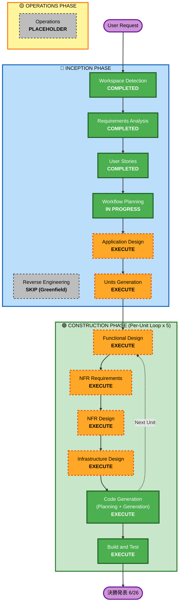

# Execution Plan

**作成日**: 2026-04-29
**フェーズ**: INCEPTION - Workflow Planning（ALWAYS EXECUTE）
**前提**: `requirements.md` / `personas.md` / `stories.md` 承認済み

---

## 1. Detailed Analysis Summary

### 1.1 プロジェクトタイプ
- **Greenfield**（既存コードなし、Reverse Engineering スキップ済み）

### 1.2 Change Impact Assessment

| 影響領域 | 該当 | 詳細 |
| --- | --- | --- |
| **User-facing changes** | ✅ | Web UI（サジェスチョン画面・ミラー）+ 音声 UI（イヤホン経由）の新規構築 |
| **Structural changes** | ✅ | 3 エージェント + 1 機能 Unit + 認証 + データレイヤーのアーキテクチャを新規定義 |
| **Data model changes** | ✅ | プロファイル、選択ログ、委譲履歴、フェーズ状態のスキーマを新規設計 |
| **API changes** | ✅ | サジェスチョン取得、選択送信、委譲アクション、ミラー集計 などの API を新規定義 |
| **NFR impact** | ✅ | パフォーマンス（応答時間）、セキュリティ最低限、PBT 全強制（NFR-4）、AWS コスト管理（NFR-2） |

### 1.3 Risk Assessment

| 項目 | 評価 |
| --- | --- |
| **Risk Level** | **Medium〜High** |
| **Rollback Complexity** | N/A（Greenfield、ハッカソンのため本番運用想定なし） |
| **Testing Complexity** | **High**（PBT-01〜PBT-10 全強制、3 エージェント間の状態遷移検証、音声 UI のレイテンシ検証） |

#### 主なリスク
- **Bedrock AgentCore は新しいマネージドサービス** で、東京リージョンでの利用条件・モデル制約に未知数
- **3 エージェント間の状態管理**（プロファイル ↔ フェーズ判定 ↔ 自律実行）の整合性
- **音声 UI のレイテンシ**（NFR-5: 音声合成 → 再生開始 < 3 秒）
- **ハッカソン期間の短さ**（5/10 書類審査、5/30 予選、6/26 決勝）

### 1.4 Component Identification（Greenfield）

ハッカソン MVP の構成要素:

| Component | 種別 | 関連 FR | 関連 Story |
| --- | --- | --- | --- |
| サジェスチョン・エージェント | AI Agent | FR-1, FR-2 | Epic 2, 3 |
| プロファイル・エージェント | AI Agent | FR-4, FR-5 | Story 2.5, 3.5 |
| 委譲＆実行エージェント | AI Agent | FR-3, FR-9 | Epic 4, Story 2.4, 3.4 |
| ミラー・ビュー | 非 AI（集計＋UI） | FR-7 | Epic 5 |
| 認証基盤 | Infrastructure | FR-8 | Story 1.1 |
| 音声 UI（Polly 統合） | Cross-cutting | FR-6 | Story 2.4, 3.4, 各 Phase |
| 共通基盤（API GW、Lambda scaffold、DynamoDB） | Infrastructure | NFR-1 | 全 Story の前提 |

---

## 2. Workflow Visualization

---

## 3. Phases to Execute

### 🔵 INCEPTION PHASE
- [x] Workspace Detection — **COMPLETED** (2026-04-29)
- [x] Reverse Engineering — **SKIPPED**（Greenfield のため不要）
- [x] Requirements Analysis — **COMPLETED & APPROVED** (2026-04-29)
- [x] User Stories — **COMPLETED & APPROVED** (2026-04-29)
- [x] Workflow Planning — **IN PROGRESS**（本ドキュメント）
- [ ] **Application Design — EXECUTE**
  - **Rationale**: 3 エージェント + ミラー View + 認証基盤 + 音声 UI + 共通基盤の **コンポーネント境界とサービス層** を新規定義する必要がある。エージェント間の依存関係（プロファイル ↔ サジェスチョン ↔ 委譲＆実行）と、各コンポーネントのメソッド/責務を確定させなければ Code Generation に進めない
- [ ] **Units Generation — EXECUTE**
  - **Rationale**: 並行開発のため、システムを 4-5 個の独立した Unit に分解する必要がある。チーム 4 名で Unit を分担して並走実装するために必須

### 🟢 CONSTRUCTION PHASE（Per-Unit Loop × 5 Unit）

各 Unit について、以下のステージを順次実行:

- [ ] **Functional Design — EXECUTE**（per-unit）
  - **Rationale**: 各 Unit のビジネスロジック（フェーズ判定アルゴリズム、嗜好ベクトル更新、自律実行トリガー判定など）を詳細設計。**PBT-01 適用** により Testable Properties セクションが必須
- [ ] **NFR Requirements — EXECUTE**（per-unit）
  - **Rationale**: NFR-5 パフォーマンス目標（応答 < 5 秒、音声合成 < 3 秒）を Unit ごとに分解し、PBT フレームワーク（fast-check 候補）を確定する
- [ ] **NFR Design — EXECUTE**（per-unit）
  - **Rationale**: NFR Requirements で定めた性能目標を達成するキャッシュ戦略・接続プール・Bedrock 並列呼び出しなどの設計
- [ ] **Infrastructure Design — EXECUTE**（per-unit）
  - **Rationale**: 各 Unit の AWS リソース（Lambda、DynamoDB、Bedrock AgentCore、Polly、Cognito、API Gateway、CloudFront）のマッピングと CDK/SAM スタック構成
- [ ] **Code Generation — EXECUTE**（per-unit、ALWAYS）
  - **Rationale**: 実装フェーズ
- [ ] **Build and Test — EXECUTE**（after all units、ALWAYS）
  - **Rationale**: 全 Unit 結合後のビルド・統合テスト・PBT 実行・パフォーマンステスト

### 🟡 OPERATIONS PHASE
- [ ] Operations — **PLACEHOLDER**
  - **Rationale**: ハッカソンには不要。決勝後に検討余地

---

## 4. Unit 構成（仮）

Application Design / Units Generation の事前案。詳細は当該ステージで確定する。

| Unit | 名称 | 責務概要 | 主担当（推奨） | 依存先 |
| --- | --- | --- | --- | --- |
| **Unit 0** | 共通基盤 | Cognito 認証、API Gateway、Lambda 共通レイヤー、DynamoDB スキーマ、CDK 基盤、CI/CD | BE / インフラ | — |
| **Unit 1** | プロファイル・エージェント | 選択ログ集約、嗜好ベクトル更新、フェーズ自動判定 | AI/ML | Unit 0 |
| **Unit 2** | サジェスチョン・エージェント | フェーズに応じた選択肢生成、選択ログ提出 | AI/ML + BE | Unit 0, Unit 1 |
| **Unit 3** | 委譲＆実行エージェント | 委譲アクション処理、Phase 4 自律実行、Polly 音声報告 | BE + AI/ML | Unit 0, Unit 1 |
| **Unit 4** | ミラー・ビュー | ログ集計、ダッシュボード UI、自己決定能力スコア時系列 | FE + BE | Unit 0 |
| **横断要素** | 音声 UI 統合・React UI 全般・トーン文言統括 | UI / UX レイヤー | FE + 企画 | 全 Unit |

**クリティカルパス**: Unit 0 → Unit 1 → Unit 2/3 並走 → Unit 4

---

## 5. ハッカソンマイルストーンと AI-DLC ステージ対応

| 日付 | マイルストーン | AI-DLC 完了目標 | 主成果物 |
| --- | --- | --- | --- |
| 2026-04-29（本日） | INCEPTION 開始 | Workspace Detection / Requirements / User Stories / Workflow Planning | `requirements.md`, `stories.md`, `personas.md`, `execution-plan.md` |
| 〜2026-05-10（土） | **書類審査提出** | Application Design + Units Generation 完了 | `application-design.md`, `units.md`、各 Unit の概要設計、`README.md`（アプリケーション説明）/ `HACKATHON.md`（大会概要、2026-05-02 に旧 README から退避）の整備 |
| 〜2026-05-15 | 書類審査結果通知 | （提出物の精査・微調整期間） | — |
| 〜2026-05-30（土） | **予選会** | Construction Phase（Must Story 全完了 + Should Story 大半） + Build and Test | 動作する MVP デモ + プレゼン |
| 〜2026-06-26（金） | **決勝** | Could Story 完了 + 実演芸風寸劇練習 + AWS 本番デプロイ | 完成ソースコード + AWS デプロイ済みデモ + プレゼン |

---

## 6. リソース配分（4 名混成チーム × 約 8 週間）

| 期間 | フェーズ | 主要担当 |
| --- | --- | --- |
| Week 1（4/29〜5/3） | Application Design + Units Generation 着手 | 全員（特に企画 + AI/ML） |
| Week 2（5/4〜5/10） | Units Generation 完成 → 書類審査提出 | 全員 |
| Week 3〜4（5/11〜5/24） | Unit 0 → Unit 1 → Unit 2/3 並走（Functional〜NFR〜Infra Design + Code Gen 着手） | BE / AI/ML 主導 |
| Week 5（5/25〜5/30） | Unit 4（ミラー）+ 統合テスト + Build and Test → 予選デモ | FE / 企画 主導 |
| Week 6〜8（6/1〜6/26） | Should/Could Story 実装、AWS 本番デプロイ、寸劇練習、プレゼン磨き込み | 全員 |

---

## 7. PBT 拡張対応の検査ポイント

NFR-4 で PBT 全強制 opt-in を選択。以下のステージで PBT コンプライアンスを検証する:

| ステージ | 検証項目 | 関連 PBT ルール |
| --- | --- | --- |
| Functional Design（per-unit） | "Testable Properties" セクションがあるか | PBT-01 |
| NFR Requirements（per-unit） | PBT フレームワーク選定が明示されているか | PBT-09 |
| Code Generation（per-unit） | Round-trip / Invariant / Idempotence / Oracle / Stateful PBT が必要箇所に書かれているか | PBT-02〜PBT-06 |
| Code Generation（per-unit） | Generator 品質（domain-specific）、shrinking 有効、seed reproducibility | PBT-07, PBT-08 |
| Build and Test | PBT が CI に組み込まれているか、seed ログ出力 | PBT-08 |
| 全ステージ | example-based テストとの併用（PBT 単独で重要パスを覆わない） | PBT-10 |

---

## 8. Estimated Timeline & Effort

- **総期間**: 約 8 週間（2026-04-29 〜 2026-06-26）
- **書類審査までの集中期間**: 約 1.5 週間（4/29〜5/10）
- **Construction フェーズ**: 約 4 週間（5/11〜5/30 の予選まで）
- **完成度向上＋発表準備**: 約 3.5 週間（6/1〜6/26）

---

## 9. Success Criteria

### 主目標
1. **書類審査通過**（5/10 提出 → 5/15 までに通知）
2. **予選会通過**（5/30 ＠麻布台ヒルズ）
3. **決勝での発表完了**（6/26 AWS Summit Japan 2026 ＠幕張メッセ）

### 主要 Deliverables
- 公開 GitHub リポジトリ（aidlc-docs/、ソースコード、README、設計ドキュメント）
- 動作する MVP（連絡 + 人間関係 2 カテゴリ × Phase 1〜4）
- AWS 本番デプロイ済みのデモ環境
- 決勝プレゼン資料 + 実演芸風寸劇

### Quality Gates
- [ ] Inception フェーズ全成果物がレビュー＆承認済み
- [ ] 各 Unit の Functional Design に Testable Properties が明記
- [ ] PBT が CI で実行され、shrinking と seed ログが機能している
- [ ] Must Story（10 件）が全て動作デモで再現可能
- [ ] パフォーマンス NFR（応答 < 5 秒、音声 < 3 秒、ミラー < 2 秒）が満たされている
- [ ] AWS 本番デプロイ環境で全機能が動作する

---

## 10. Phase Determination Rationale Summary

| ステージ | 判定 | 主理由 |
| --- | --- | --- |
| Reverse Engineering | SKIP | Greenfield |
| User Stories | EXECUTE（実施済み） | 新規ユーザー対面プロダクト、複雑なフェーズ遷移 |
| Application Design | EXECUTE | 新規コンポーネント多数、エージェント間関係定義必要 |
| Units Generation | EXECUTE | 4-5 Unit に分解して並行開発、書類審査の「Unit 分解の適切さ」評価軸 |
| Functional Design (per-unit) | EXECUTE | ビジネスロジック設計＋PBT-01 必須 |
| NFR Requirements (per-unit) | EXECUTE | パフォーマンス目標＋PBT-09 |
| NFR Design (per-unit) | EXECUTE | NFR Requirements がある以上必要 |
| Infrastructure Design (per-unit) | EXECUTE | AWS リソース設計が必須 |
| Code Generation (per-unit) | EXECUTE（ALWAYS） | 実装フェーズ |
| Build and Test | EXECUTE（ALWAYS） | 統合テスト＋PBT CI |
| Operations | PLACEHOLDER | ハッカソン範囲外 |
